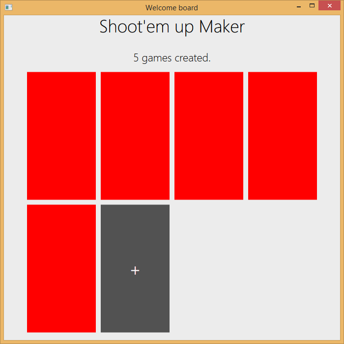

Shoot'em up Maker
====
> A game tool project for BJTU.

### Download

* (soon)

### How to use

1. --
2. --
3. --
4. --
5. --

## Todo

* --
* --

### Release history

All releases are here : https://github.com/CostardRouge/ShootEmUpMaker/releases

### Authors
* Steeve Pommier ([Github](https://github.com/CostardRouge) / [Twitter](https://twitter.com/LeBlousonRouge))
* Juju013 ([Github](https://github.com/Juju013))
* alex-ng ([Github](https://github.com/alex-ng))
* dagasan ([Github](https://github.com/dagasan))